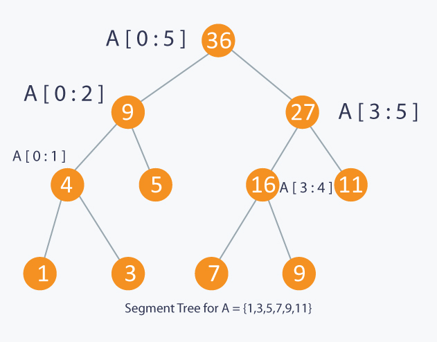

# Data-Structures-Algorithms

## Linked List
* A Linked List is a linear collection of data elements, called nodes, each pointing to the next node by means of a pointer. It is a data structure consisting of a group of nodes which together represent a sequence.
* Singly-linked list: linked list in which each node points to the next node and the last node points to null
* Doubly-linked list: linked list in which each node has two pointers, p and n, such that p points to the previous node and n points to the next node; the last node's n pointer points to null
* Circular-linked list: linked list in which each node points to the next node and the last node points back to the first node
* Time Complexity:
   - Access: O(n)
   - Search: O(n)
   - Insert: O(1)
   - Remove: O(1)
   
   
## Stack
* A Stack is a collection of elements, with two principle operations: push, which adds to the collection, and pop, which removes the most recently added element
* Last in, first out data structure (LIFO): the most recently added object is the first to be removed
* Time Complexity:
   - Access: O(n)
   - Search: O(n)
   - Insert: O(1)
   - Remove: O(1)
   
   
## Queue
* A Queue is a collection of elements, supporting two principle operations: enqueue, which inserts an element into the queue, and dequeue, which removes an element from the queue
* First in, first out data structure (FIFO): the oldest added object is the first to be removed
* Time Complexity:
   - Access: O(n)
   - Search: O(n)
   - Insert: O(1)
   - Remove: O(1)
   
## Tree 

## Segement Tree 
   * Leaf Nodes are the elements of the input array 
   * Each internal node represents some merging of the leaf nodes. The merging may be different for different problems. 
   * An array representation of tree is used to represent Segment Trees. For each node at index i, the left child is at index 2*i+1, right child at 2*i+2 and the parent is at st1.
   * In each step, the segment is divided into half and the two children represent those two halves. So the height of the segment tree will be log2N. 
   * There are N leaves representing the N elements of the array. The number of internal nodes is N-1, so the total number of nodes are 2*N-1.
   * Time Complexity:
      - Range Query: O(log(n))
      - Update: O(log(n))
      
      
   
   
   
         ### Implementation 
         
          
